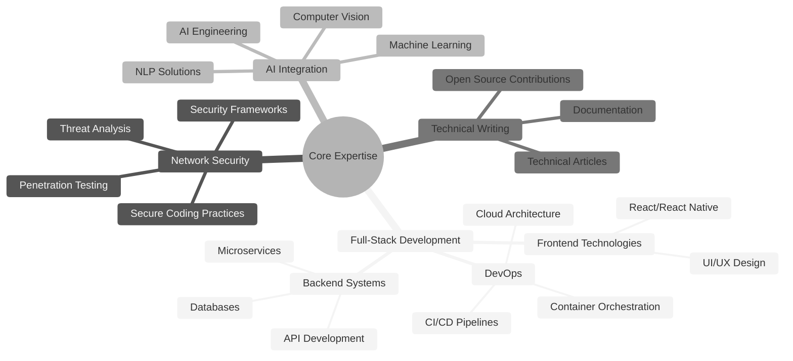

# Al Ghozali Ramadhan

<div align="center">
  <a href="https://git.io/typing-svg"></a>
</div>

<div align="center">
  <a href="https://www.linkedin.com/in/al-ghozali-ramadhan-73966a283/"></a>
  <a href="https://github.com/awiones"></a>
  <a href="https://twitter.com/ojah77"></a>
  <a href="https://instagram.com/oja_tp"></a>
  <a href="mailto:awiones@gmail.com"></a>
</div>

## About Me

I'm a full-stack developer and network security specialist based in Indonesia, with a passion for building secure, scalable applications and exploring cutting-edge AI technologies.

```python
class AlGhozali:
    def __init__(self):
        self.name = "Al Ghozali Ramadhan"
        self.role = "Full-Stack Developer & Security Specialist"
        self.location = "Indonesia"
        self.languages = ["Python", "JavaScript", "TypeScript", "PHP", "Go", "C", "C++"]
        self.interests = ["Security Research", "AI Development", "Creative Writing"]
        
    def say_hi(self):
        print("Thanks for visiting my profile! Let's build something amazing together.")

me = AlGhozali()
me.say_hi()
```

> I blend technical expertise with creative problem-solving, specializing in full-stack development, network security, and AI integration. Committed to writing clean, efficient code and implementing robust security measures in every project.

<details>
  <summary><b>More about me</b></summary>
  <br>
  
  - 🔭 Currently exploring: DDoS and stress-testing tools (for educational and defensive research purposes), and computer connect one to each other
  - 🌱 Learning: Network security, mitigation techniques, and DDoS attack methodologies
  - 💬 Areas of expertise: Full-stack development, cybersecurity, AI integration
  - 📝 When not coding: Writing technical articles and creative fiction
  - 🌐 Languages: English, Indonesian (Native)
</details>

## Technical Expertise

### Languages & Frameworks

<div>
  
  
  
  
  
  
  
  
</div>

### Frontend Development

<div>
  
  
  
  
  
  
</div>

### Backend & Database

<div>
  
  
  
  
  
  
  
</div>

<div>
  
  
  
</div>

### DevOps & Security

<div>
  
  
  
  
  
  
  
</div>

## Professional Focus Areas

<div align="center">



</div>

## GitHub Analytics

<div align="center">
  
  
</div>

## Let's Connect

I'm always open to interesting conversations and collaboration opportunities:

<div align="center">
  <a href="https://www.linkedin.com/in/al-ghozali-ramadhan-73966a283/"></a>
  <a href="mailto:awiones@gmail.com"></a>
  <a href="https://twitter.com/ojah77"></a>
</div>

## Support My Work

<div align="center">
  <a href="https://ko-fi.com/awiones"></a>
  <a href="https://buymeacoffee.com/awiones"></a>
</div>

<div align="center">
  
</div>

<div align="center">
  
</div>

<div align="center">
  <em>"Building technology that matters, with security at its core."</em>
</div>
