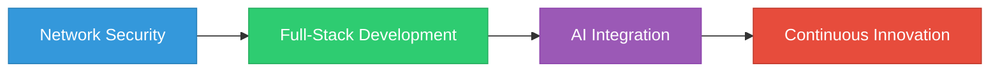

# Al Ghozali Ramadhan

  

## 👨‍💻 About Me

> Innovative software developer specializing in full-stack development, network security, and AI technologies. Crafting effective technical solutions with a passion for clean code and cutting-edge technologies.

## 🛠️ Tech Stack

<table>
  <tr>
    <td valign="top" width="33%">
      <h3 align="center">Frontend</h3>
      
  
          
          
          
          
          
          
      

    </td>
    <td valign="top" width="33%">
      <h3 align="center">Backend</h3>
      
  
          
          
          
          
          
          
      

    </td>
    <td valign="top" width="33%">
      <h3 align="center">DevOps & Security</h3>
      
  
          
          
          
          
          
          
      

    </td>
  </tr>
</table>

  
    
    
    
    
    
    

## 🚀 Featured Projects

<table>
  <tr>
    <td width="50%">
      <h3 align="center">Titan-O</h3>
      

        
      

      

        <strong>Offline AI Chat Web Application</strong> - An innovative web platform for local AI interactions powered by Ollama, offering sophisticated conversational capabilities without requiring internet connectivity.
      

      
<strong>Tech: </strong>PHP, JavaScript, Ollama, HTML/CSS

    </td>
    <td width="50%">
      <h3 align="center">NEScan</h3>
      

        
      

      

        <strong>Network Exploration & Security Tool</strong> - Comprehensive Python utility for network analysis featuring DNS resolution, port scanning, SSL certificate retrieval, Whois data lookup, and IP geolocation.
      

      
<strong>Tech: </strong>Python, Network Security Libraries

    </td>
  </tr>
  <tr>
    <td width="50%">
      <h3 align="center">EasyFuzzScan</h3>
      

        
      

      

        <strong>Security Scanning Utility</strong> - User-friendly security assessment tool designed for efficient vulnerability detection and analysis.
      

      
<strong>Tech: </strong>Security Framework, Python

    </td>
    <td width="50%">
      <h3 align="center">Creative Work</h3>
      

        
      

      

        <strong>God of Grinding</strong> - Published novel showcasing creative writing abilities alongside technical expertise, demonstrating versatility across disciplines.
      

    </td>
  </tr>
</table>

## 📊 GitHub Stats

  

  
  

## 💼 Professional Experience

---

  

  <i>Innovating at the intersection of technology and creativity</i>

