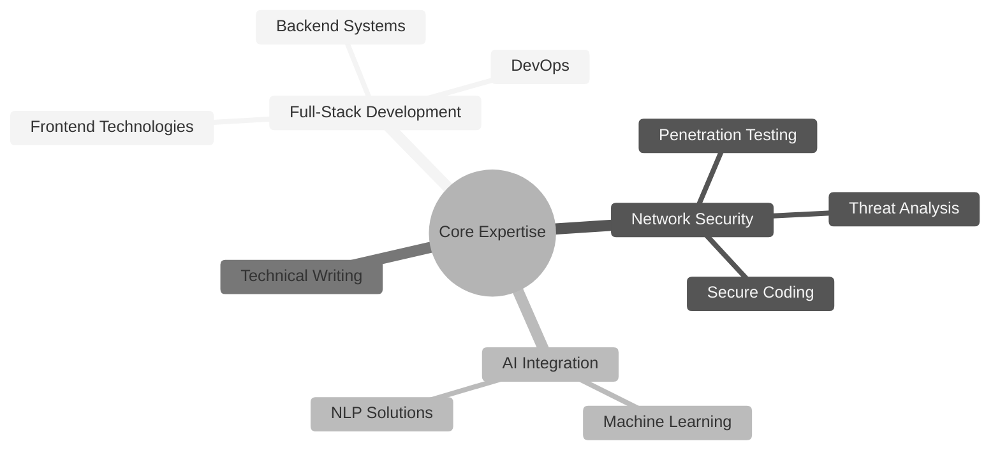

# Al Ghozali Ramadhan

<div align="center">
  <a href="https://git.io/typing-svg"></a>
</div>

<div align="center">
  <a href="https://www.linkedin.com/in/al-ghozali-ramadhan-73966a283/"></a>
  <a href="https://github.com/awiones"></a>
  <a href="https://twitter.com/ojah77"></a>
  <a href="mailto:awiones@gmail.com"></a>
  <a href="https://awiones.github.io/Al-Portofolio/"></a>
</div>

## About Me

Full-stack developer and network security specialist based in Indonesia, with a focus on building secure, scalable applications and integrating AI technologies. I blend technical expertise with creative problem-solving to deliver robust solutions across various domains.

```python
class AlGhozali:
    def __init__(self):
        self.name = "Al Ghozali Ramadhan"
        self.role = "Full-Stack Developer & Security Specialist"
        self.location = "Indonesia"
        self.languages = ["Python", "JavaScript", "TypeScript", "PHP", "Go", "C", "C++"]
        self.interests = ["Security Research", "AI Development", "Creative Writing"]
        
    def say_hi(self):
        print("Thanks for visiting my profile! Let's build something amazing together.")

me = AlGhozali()
me.say_hi()
```

## Core Competencies

<div align="center">



</div>

## GitHub Analytics

<div align="center">
  
  
</div>

---

<div align="center">
  
</div>

<div align="center">
  
</div>

<div align="center">
  <em>"Building technology that matters, with security at its core."</em>
</div>
