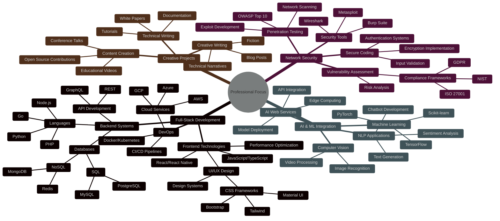

# Al Ghozali Ramadhan 

<div align="center">
  <a href="https://git.io/typing-svg"></a>
</div>

<div align="center">
  
  [](https://twitter.com/ojah77)
  [](https://instagram.com/oja_tp)
  [](https://github.com/awiones)
  [](https://www.linkedin.com/in/al-ghozali-ramadhan-73966a283/)
  
</div>

<p align="center">
  <a href="#about-me">About Me</a> •
  <a href="#projects">Projects</a> •
  <a href="#skills">Skills</a> •
  <a href="#stats">Stats</a> •
  <a href="#contact">Contact</a>
</p>

## <a name="about-me"></a>👨‍💻 About Me


```python
class AlGhozali:
    def __init__(self):
        self.name = "Al Ghozali Ramadhan"
        self.role = "Full-Stack Developer & Security Specialist"
        self.location = "Indonesia"
        self.languages = ["Python", "JavaScript", "PHP", "SQL", "Bash"]
        self.hobbies = ["Coding", "Writing", "Security Research", "AI Exploration"]
        
    def say_hi(self):
        print("Thanks for dropping by! Let's build something amazing together!")

me = AlGhozali()
me.say_hi()
```

> Innovative software developer specializing in full-stack development, network security, and AI technologies. Crafting effective technical solutions with a passion for clean code and cutting-edge technologies. Published author with a unique blend of technical expertise and creative writing skills.

<details>
  <summary>⚡ More about me</summary>
  <br>
  <p>
    🔭 &nbsp; I'm currently working on AI-powered security tools and offline AI applications<br>
    🌱 &nbsp; I'm constantly learning new technologies and frameworks<br>
    💬 &nbsp; Ask me about anything tech-related, I am happy to help<br>
    📫 &nbsp; Feel free to ping me on LinkedIn<br>
    📝 &nbsp; When I'm not coding, I write creative fiction and technical articles<br>
  </p>
</details>

<hr>

## <a name="projects"></a>🚀 Featured Projects

### 🤖 Titan-O
<p>
  
  
  
</p>

**Offline AI Chat Web Application** - An innovative web platform for local AI interactions powered by Ollama, offering sophisticated conversational capabilities without requiring internet connectivity.

<details>
  <summary><b>✨ View Project Details</b></summary>
  
  ### Key Features
  - 🔒 Local model hosting with Ollama backend
  - 💬 Real-time conversation interface with streaming responses
  - 🧠 Multiple AI model support
  - 💻 Cross-platform compatibility
  - 🛡️ Zero internet dependency for enhanced privacy
  
  [](https://github.com/awiones/Titan-O-) 
  [](https://github.com/awiones/Titan-O-)
</details>

### 🔍 NEScan
<p>
  
  
  
</p>

**Network Exploration & Security Tool** - Comprehensive Python utility for network analysis featuring DNS resolution, port scanning, SSL certificate retrieval, Whois data lookup, and IP geolocation.

<details>
  <summary><b>✨ View Project Details</b></summary>
  
  ### Key Features
  - 🚀 Multi-threaded port scanning
  - 🔐 SSL certificate analysis
  - 🌐 DNS enumeration
  - 🗺️ IP geolocation mapping
  - 📋 WHOIS data retrieval
  
  [](https://github.com/awiones/NEScan) 
</details>

### 🔬 MercuriesOST
<p>
  
  
</p>

**Advanced Open Source Intelligence Tool** - A powerful OSINT framework that gathers, analyzes, and visualizes information from the web, helping researchers, security professionals, and investigators track digital footprints across major online platforms.

<details>
  <summary><b>✨ View Project Details</b></summary>
  
  ### Key Features
  - 🔍 Automated data gathering from multiple online sources
  - 📊 Interactive data visualization and analysis
  - 🌐 Social media footprint discovery
  - 🔄 Rate limit handling for efficient scanning
  - ⚙️ Optimized system resource utilization
  
  [](https://github.com/awiones/MercuriesOST)
  [](https://github.com/awiones/MercuriesOST)
</details>


## <a name="skills"></a>💻 Technical Expertise

<details open>
  <summary><b>Frontend Development</b></summary>
  <br>
  
  
  
  
  
  
  
  
  
  
</details>

<details>
  <summary><b>Backend Development</b></summary>
  <br>
  
  
  
  
  
  
  
  
  
  
  
  
</details>

<details>
  <summary><b>DevOps & Security</b></summary>
  <br>
  
  
  
  
  
  
  
  
  
  
  
</details>

<hr>

## <a name="stats"></a>📊 GitHub Analytics

<div align="center">
  
</div>

<div align="center">
   
 </div>

<div align="center">
  
</div>

<hr>

## 🧠 Professional Focus Areas

<div align="center">



</div>

<hr>

## <a name="contact"></a>📫 Let's Connect!

<p align="center">
  <a href="mailto:awiones@gmail.com"></a>
  <a href="https://www.linkedin.com/in/al-ghozali-ramadhan-73966a283/"></a>
  <a href="https://twitter.com/ojah77"></a>
</p>

## 💰 Support My Work

<div align="center">
  <a href="https://paypal.me/aghozali77"></a>
  <a href="https://ko-fi.com/awiones"></a>
  <a href="https://buymeacoffee.com/awiones"></a>
</div>

<hr>

<div align="center">
  
</div>

<div align="center">
  
</div>

<div align="center">
  <em>"Innovating at the intersection of technology and creativity, one line of code at a time."</em>
</div>
