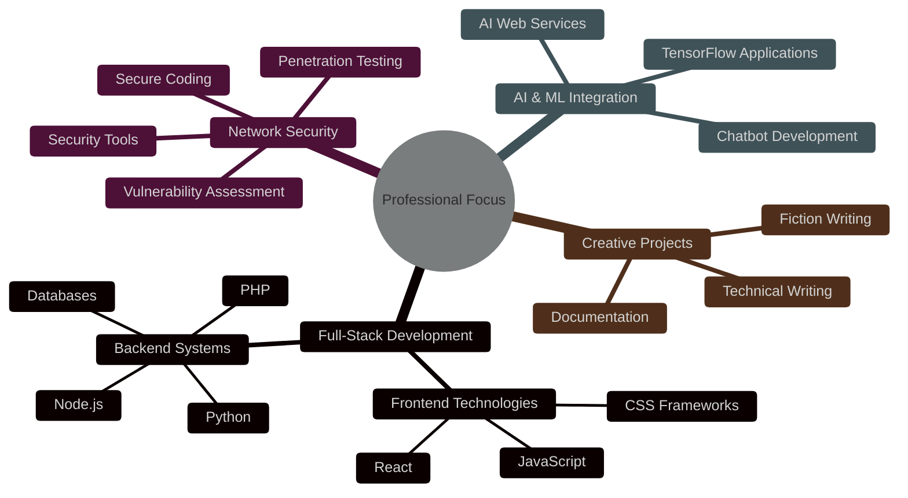

# Al Ghozali Ramadhan

<div align="center">
  
</div>

<div align="center">
  
  [](https://twitter.com/ojah77)
  [](https://instagram.com/oja_tp)
  [](https://github.com/awiones)
  [](https://linkedin.com)
  
</div>

## About Me

```python
class AlGhozali:
    def __init__(self):
        self.name = "Al Ghozali Ramadhan"
        self.role = "Full-Stack Developer & Security Specialist"
        self.location = "Indonesia"
        self.languages = ["Python", "JavaScript", "PHP", "SQL", "Bash"]
        self.hobbies = ["Coding", "Writing", "Security Research", "AI Exploration"]
        
    def say_hi(self):
        print("Thanks for dropping by! Let's build something amazing together!")

me = AlGhozali()
me.say_hi()
```

> Innovative software developer specializing in full-stack development, network security, and AI technologies. Crafting effective technical solutions with a passion for clean code and cutting-edge technologies. Published author with a unique blend of technical expertise and creative writing skills.

## Featured Projects

<table>
  <tr>
    <td width="50%" valign="top">
      <h3 align="center"><a href="https://github.com/awiones/Titan-O-">Titan-O</a></h3>
      <div align="center">
        
        
        
      </div>
      <p>
        <strong>Offline AI Chat Web Application</strong> - An innovative web platform for local AI interactions powered by Ollama, offering sophisticated conversational capabilities without requiring internet connectivity.
      </p>
      <div align="center">
        <a href="https://github.com/awiones/Titan-O-" target="_blank">
          
        </a>
      </div>
    </td>
    <td width="50%" valign="top">
      <h3 align="center"><a href="https://github.com/awiones/NEScan">NEScan</a></h3>
      <div align="center">
        
        
        
      </div>
      <p>
        <strong>Network Exploration & Security Tool</strong> - Comprehensive Python utility for network analysis featuring DNS resolution, port scanning, SSL certificate retrieval, Whois data lookup, and IP geolocation.
      </p>
      <div align="center">
        <a href="https://github.com/awiones/NEScan" target="_blank">
          
        </a>
      </div>
    </td>
  </tr>
  <tr>
    <td width="50%" valign="top">
      <h3 align="center"><a href="https://github.com/awiones/EasyFuzzScan">EasyFuzzScan</a></h3>
      <div align="center">
        
        
        
      </div>
      <p>
        <strong>Security Scanning Utility</strong> - User-friendly security assessment tool designed for efficient vulnerability detection and analysis across diverse network environments.
      </p>
      <div align="center">
        <a href="https://github.com/awiones/EasyFuzzScan" target="_blank">
          
        </a>
      </div>
    </td>
    <td width="50%" valign="top">
      <h3 align="center"><a href="https://www.webnovel.com/book/god-of-grinding_29416615208116505">God of Grinding</a></h3>
      <div align="center">
        
        
        
      </div>
      <p>
        <strong>Published Web Novel</strong> - Creative writing project showcasing storytelling abilities alongside technical expertise, demonstrating versatility across disciplines with engaging narrative.
      </p>
      <div align="center">
        <a href="https://www.webnovel.com/book/god-of-grinding_29416615208116505" target="_blank">
          
        </a>
      </div>
    </td>
  </tr>
</table>

## Technical Expertise

<div>
  <table width="100%" border="0">
    <tr>
      <td valign="top" width="50%">
        <h3 align="center">Frontend Development</h3>
        <div align="center">
          
          
          
          
          
          
          
        </div>
      </td>
      <td valign="top" width="50%">
        <h3 align="center">Backend Development</h3>
        <div align="center">
          
          
          
          
          
          
          
        </div>
      </td>
    </tr>
    <tr>
      <td valign="top" width="50%">
        <h3 align="center">DevOps & Security</h3>
        <div align="center">
          
          
          
          
          
          
          
        </div>
      </td>
      <td valign="top" width="50%">
        <h3 align="center">AI & Machine Learning</h3>
        <div align="center">
          
          
          
          
        </div>
      </td>
    </tr>
  </table>
</div>

## GitHub Analytics

<div align="center">
  
  
</div>

<div align="center">
  
</div>

## Professional Focus Areas

<div align="center">



</div>

## Contribution Activity

<div align="center">
  
</div>

## Support My Work

<div align="center">
  <a href="https://paypal.me/aghozali77"></a>
  <a href="https://ko-fi.com/awiones"></a>
  <a href="buymeacoffee.com/awiones"></a>
</div>

---

<div align="center">
  
</div>

<div align="center">
  <em>"Innovating at the intersection of technology and creativity, one line of code at a time."</em>
</div>
