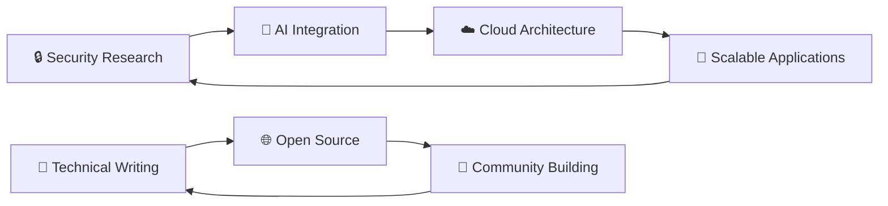

# 👋 Hello, I'm Al Ghozali Ramadhan

<div align="center">
  
</div>

<div align="center">
  
  
</div>

---

## 🚀 About Me

```python
class AlGhozali:
    def __init__(self):
        self.name = "Al Ghozali Ramadhan"
        self.role = "Full-Stack Developer & Security Specialist"
        self.location = "🇮🇩 Indonesia"
        self.current_focus = "Building secure, scalable applications with AI integration"
        self.interests = ["Security Research", "Creative Writing", "Open Source"]
        
    def current_status(self):
        return {
            "learning": ["Advanced AI/ML", "Cloud Security", "DevSecOps"],
            "working_on": ["AI-powered security tools", "Full-stack applications"],
            "collaborating": "Open to interesting projects and opportunities",
            "fun_fact": "I turn coffee into code and vulnerabilities into patches ☕"
        }

me = AlGhozali()
print(me.current_status())
```

---

## 🛠️ Tech Stack & Tools

### **Languages**


### **Frontend**


### **Backend & Database**


### **Security & DevOps**


### **AI/ML**


---

## 📊 GitHub Analytics

<div align="center">
  
  
</div>

<div align="center">
  
</div>
---

## 🏆 GitHub Trophies
<div align="center">
  
</div>

---

## 🎯 Current Focus



---

## 🤝 Connect With Me

<div align="center">
  <a href="https://www.linkedin.com/in/al-ghozali-ramadhan-73966a283">
    
  </a>
  <a href="https://twitter.com/ojah77">
    
  </a>
  <a href="mailto:awiones@gmail.com">
    
  </a>
  <a href="https://awiones.github.io/Al-Portofolio">
    
  </a>
</div>

---

## 💬 Ask Me About
- 🔐 **Cybersecurity** - Penetration testing, threat analysis, secure coding practices
- 🌐 **Full-Stack Development** - Modern web applications, API design, system architecture
- 🤖 **AI Integration** - ML model deployment, NLP solutions, AI-powered applications
- 🚀 **DevOps & Cloud** - Container orchestration, CI/CD pipelines, cloud security
- 📝 **Technical Writing** - Documentation, tutorials, security research papers

---

<div align="center">
  <h3>⭐ Star my repositories if you find them useful!</h3>
  <p><em>"Security is not a product, but a process. Let's build secure software together."</em></p>
  
  
</div>
